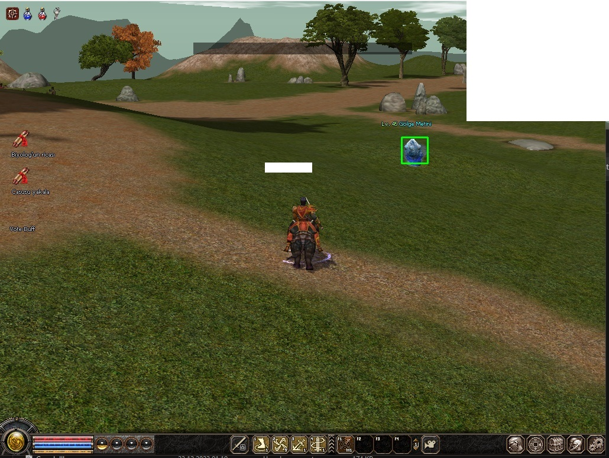

## 

TODO: item toplama düzeltilecek. (Toplamıyor.)


Resimde kendi adım ve sağ üstteki server bilgileri bölümünü beyaz ile kestim.




dtype=np.uint8
resmi grayscale yaparsan daha rahat buluyormuş. Defaultu BGR
cv2.cvtColor(img, BGR2GRAY)


| imageLoadType | Açıklaması |
| ------------- |:-------------:|
| ***cv2.IMREAD_COLOR***          | (Default flagdır) renkli resim yükler. saydamlık ihmal edilecek     |
| ***cv2.IMREAD_GRAYSCALE***      | resmi grayscale(siyah, beyaz mod) olarak yükler     |
| ***cv2.IMREAD_UNCHANGED***      | resmi alpha kanalı dahil olarak yükler     |


<h2 style="color:red"><b><i>RESMİ GÖSTERME</h2>

```python
image = cv.imread("imagePath", imageLoadType)
cv2.imshow("windowName", image)
cv2.waitKey(0)
cv2.destroyAllWindows() #Tüm windowsları siler
```

> uygulamanın sonsuz olarak çalışması için (0 = infinite time mesela 5 verseydik 5 saniye olurdu.)


<h2 style="color:red"><b><i>RESMİ HİZALAMA</h2>

```python
cv2.resize(image, (400, 400)) # 400 x 400 olarak küçültür.
cv2.resize(image, (0, 0), fx=0.5, fy=0.5) # resmin boyutu 1000x1000 ise 500x500 yaptık aslında.
cv2.rotate(image, cv2.cv2.ROTATE_180)
cv2.imwrite("new_image.jpg", image)
```
```python
print(type(tas))  === 'numpy.ndarray'
print(img.shape)  === (imgHeight, imgWidth, imgChannels) RGB & BGR
```

channel dediğimiz şey colorspace. Resimdeki 1 pikseli kaç değer ifade ediyor onu belirtiyor. default olarak 3'tür bunlar Red Green and Blue

Standart RGB olmasına rağmen openCV BGR kullanır


<h2 style="color:red"><b><i>RESİM NEDİR</h2>

bir resim 3 boyutlu bir alandan oluşur. Örnek

``` python

[
    [
        [0,0,0], [255,255,255]
    ],
    [
        [0,0,0], [255,255,255]
    ]   
]

```

1.Array'in içerisindeki değerler ROW'u temsil eder.
ROW'ların(2.array) içerisindeki değerler COLUMN'u temsil eder.
Mesela yukarıdaki örnekte 4 pixellik bir resim tanımladık. 
Sol üst ve sol alt siyah, sağ üst ve sağ alt beyaz oldu.

[0,0,0] BLUE, GREEN, RED

<h2 style="color:red"><b><i>RESİMDEKİ PİXEL RENGİNİ DEĞİŞTİRME</h2>

``` python
for i in range(123):
    for j in range(554):
        img[i][j] = [155,155,155]

```
şöyle de seçebilirsin.
tag = [200:300, 500:600]

```
i değeri = row
j değeri = column
img[12,24] mesela 12.row 24.column'u ifade eder
row = ----  column = |
```
<h2 style="color:red"><b><i>VİDEO YA DA KAMERA YAKALAMA</h2>

```
video = cv2.VideoCapture("video/metin2.mp4") Video için
video = cv2.VideoCapture(0) Kamera için (0 = device no)

while video.isOpened():
    ret, frames = cap.read() 


# frames
mesela 24 fps bir videoda saniyede 24 resim var ya işte frames = bir videodaki tüm resimler.

# ret
bu capture'lama işlemi başarılı mı çalıştı mı onu alıyor. ret = false olursa bir problem var demek 
```

<h2 style="color:red"><b><i>DİZİDE SEÇME İŞLEMİ</h2>

```
image[:height//2, :width//2] # TOP LEFT
image[height//2:, :width//2] # BOTTOM LEFT
image[:height//2, width//2:] # TOP RIGHT
image[height//2:, width//2:] # BOTTOM RIGHT
```
<h2 style="color:red"><b><i>CV2 İLE ÇİZİM İŞLEMİ</h2>

```
cv2.rectangle(img, (x0,y0), (x1,y1), color, thickness)
cv2.line(img, (x0,y0), (x1,y1), color, thickness)
cv2.circle(frame, (x0,y0), radius(size), color, thickness)
```

<h2 style="color:red"><b><i>CV2 İLE YAZI YAZMA</h2>

```
font = cv2.FONT_HERSHEY_COMPLEX
frame = cv2.putText(frame, "Deneme", (x0, y0), font, fontSize, color, thickness, cv2.LINE_AA)
```

<h2 style="color:red"><b><i>CV2 İLE EKRANDAKİ BELİRLİ RENK ARALIĞINI SİLME</h2>

``` python
hsv = cv2.cvtColor(frame, cv2.COLOR_BGR2HSV)
lower = np.array([30,90,30])
upper = np.array([255,255,255])
mask = cv2.inRange(hsv, lower, upper)
result = cv2.bitwise_and(frame, frame, mask=mask)
```

Eğer lower ve upper aşağıdaki gibi olursa
```
lower = np.array([0,0,0])
upper = np.array([255,255,255])
```
Bu bütün renkleri dahil ederdi. Yani mask'a gerek kalmaz.
bitwise_and kullanıyoruz. Bundan dolayı and bağlacı ile renkleri bağlıyor.

<h2 style="color:red"><b><i>CV2 İLE CORNER DETECTION</h2>

``` python
corners = cv2.goodFeaturesToTrack(image, "(int kacKoseBulsun?)","quality 0-1", "int 2CornerArasiMesafe")
corners = np.int0(corners) # floatingPoint corner değerlerini int'e dönüştürür.

for corner in corners:
    x,y = corner.ravel()
    cv2.circle(img, (x,y), 5, (255.0.0), -1)
```

<h2 style="color:red"><b><i>cv2.matchTemplate()</h2>

``` 
min_val: Görüntü üzerindeki en küçük değer.
max_val: Görüntü üzerindeki en büyük değer.
min_loc: En küçük değerin konumu (x, y koordinatları).
max_loc: En büyük değerin konumu (x, y koordinatları).
```


<h2 style="color:red"><b><i>ÖNEMLİ NOTLAR</h2>

``` 
BGR/RGB/HSV etc have 3 channels.
ayrıca BGR ve RGB shape'inde bulunan channel 4 iken (a,b,4) HSV shape'inin channel'i (a,b,3) şeklinde. 4.nün adı AlphaChannel
Grayscale has only one channel. so the value is stored directly (instead of a one-value array).

# get dimensions of image
dimensions = img.shape
 
# height, width, number of channels in image
height = img.shape[0]
width = img.shape[1]
channels = img.shape[2]

AYRICA eğer win11 kullanıyorsan printScreen tuşu ile bir ekran görüntüsü kaydedersen bu resimde alphaChannel'de bulunur. Ekran görüntüsünü kopyalayıp paint'e yapıştırıp .png olarak alırsan da alphaChannel bulunur. Yani image.shape = (a,b,4) olur. ama resmi kopyalayıp paint üzerinden farklı kaydet ile .jpg olarak kaydedersen o zaman (a,b,3) olur.
```


<h2 style="color:red"><b><i>CascadeClassifier</h2>

``` 
Kendi pozitif ve negatif resimlerin ile cascadeClassifier eğiteceksen şunları yap.
1- Pozitif ve Negatif resimler çek. (En az 100'er tane lazım her biri için)
2- Negatif resimlerin yollarını içeren txt dosyası yap. (negative.txt) positive için yapmana gerek yok.
3- Daha sonra openCV 3.4.x sürümünü locale indir.
4- İndirdiğin opencv klasörünün path'i ile aşağıdaki komutu çalıştır.


çıktıyı positive.txt olarak verecek.
```
> path/opencv/build/x64/vc15/bin/opencv_annotation.exe --annotations=positive.txt --images=/imgFolder

```
Eğer düzgün yaptıysan artık pozitive image'ler tek tek karşına çıkacak.

* press 'c' to accept a selection,
* press 'd' to delete the latest selection,
* press 'n' to proceed with next image,
* press 'esc' to stop.

bu işlemi de bitirince positive.txt'ye girip
"\" bu karakterlerin hepsini "/" yap. Çünkü path'i bulamaz.

Şimdi bu dosya ile vector dosyası oluşturalım.
```

> path/opencv/build/x64/vc15/bin/opencv_createsamples.exe -info positive.txt -w 24 -h 24 -num 1000 -vec pos.vec

```

default olarak -w 24 -h 24 kullan. Bulabileceğin en küçük görüntünün width'i 24, height'i de 24 olacak
-num : Kaç vektör oluşturulacak. kaç adet kare içine aldıysan mesela 30 resimde 50 adet kare kullandın o zaman >= 50 olsun. bu senaryoya göre 100 veya 1000 farketmez.
çıktıyı positive.txt olarak verecek.

Eğer aşağıdaki şekilde kalırsa anla ki pos.txt'de bir hata var.
Create training samples from images collection...

daha sonra açtığımız cascade klasörü içerisine traincascade kaydedeceğiz.

```
> path/.../opencv_traincascade.exe -data cascade/ -vec pos.vec -bg negative.txt -w 24 -h 24 -numPos 100 -numNeg 100 -numStages 10

```

-bg: negative images path.txt
-numPos: kaç pozitif örnek varsa onun sayısını yazabilirsin.

```


